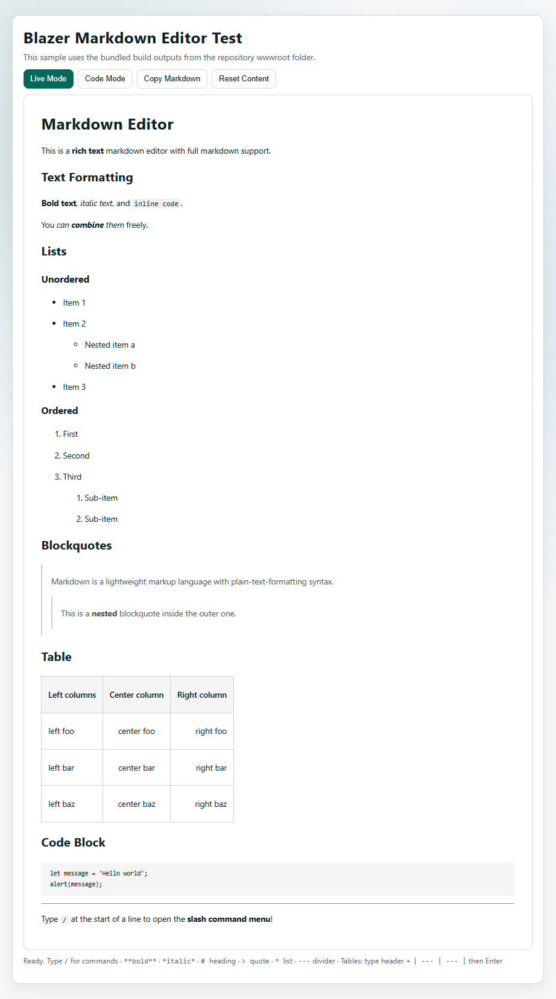
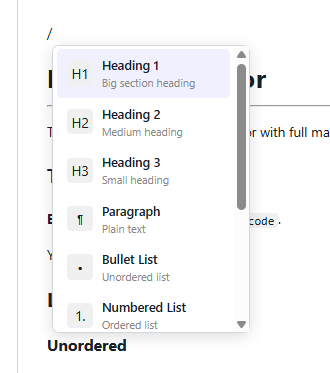

# Blazer Markdown Editor
A lightweight (<550kb) ProseMirror-based javascript Markdown editor with slash commands, table editing, and JSInterop-friendly APIs. Developed as I needed a WYSIWYG markdown editor for Blazor but all I could find was react and vue components. Can be used standalone or authored into component for Blazor. Check the demo https://iamdabe.github.io/codex/  

## Contents
- **[Features](#features)**
- **[Preview](#preview)**
- **[Install](#install)**
- **[Third-Party](#third-party)**

Additional docs:
- [JSInterop Packaging](./docs/jsinterop-packaging.md)
- [How to Use](./docs/how-to-use.md)

## Features
* Markdown-first authoring with ProseMirror document model and serializer
* Blazor-focused JSInterop API: `create`, `setMarkdown`, `getMarkdown`, `focus`, `destroy`
* Productive editing features: slash menu, table controls, link toolbar, and keyboard shortcuts

## Preview

## Install
1. Install dependencies:
   - `npm ci`
2. Build distributable assets:
   - `npm run build`
3. Include generated assets from `wwwroot` in your Blazor app:
   - `blazer-markdown-editor.css`
   - `blazer-markdown-editor.js`
   - `blazer-markdown-editor.min.js`
4. Call the global API via JSInterop:
   - `window.blazerMarkdownEditor.create(...)`
   - `window.blazerMarkdownEditor.setMarkdown(...)`
   - `window.blazerMarkdownEditor.getMarkdown(...)`
   - `window.blazerMarkdownEditor.focus(...)`
   - `window.blazerMarkdownEditor.destroy(...)`

Versioning uses a calendar schema: `YYYY.MINOR.PATCH` (current: `2026.2.1`).

## Third-Party
* markdown-it 14.1.0
* prosemirror-commands 1.6.2
* prosemirror-dropcursor 1.8.1
* prosemirror-gapcursor 1.3.2
* prosemirror-history 1.4.1
* prosemirror-inputrules 1.4.0
* prosemirror-keymap 1.2.2
* prosemirror-markdown 1.13.2
* prosemirror-model 1.24.1
* prosemirror-schema-list 1.5.1
* prosemirror-state 1.4.3
* prosemirror-tables 1.8.3
* prosemirror-view 1.38.1
